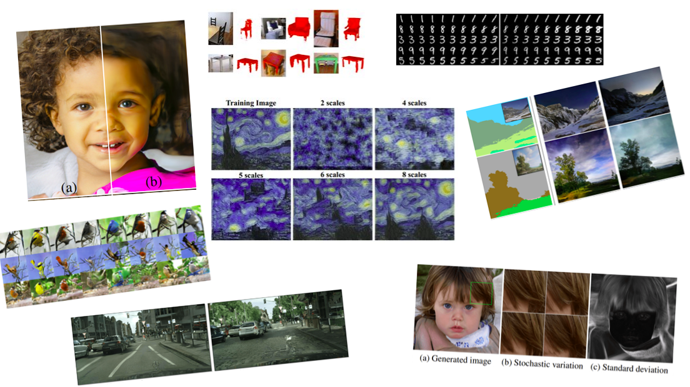

<div align="center">

</div>


# GANs in Computer Vision


## Abstract 
In this article-series we are reviewing the most fundamental works of Generative Adversarial Networks in Computer Vision. We start from the very beginning from concepts such as **generative learning, adversarial learning**. We provide some code and illustrations for educational purposes. The goal is to focus on the intuition of the models, by tackling the multiple problems that arise when training a GAN. We have thoroughly analyzed more than **20 papers in 6 different articles in a chronological order**. We will continue to update the GAN series, based on the newer publications or older ones that we skipped. We do hope that this series will provide you a big overview of the field, so that you will not need to read all the literature by yourself, independent of your background on GANs.    

## Introduction to generative learning (part 1)

Link to the article: [Introduction to generative learning - part 1](https://theaisummer.com/gan-computer-vision/) 


|First Author|Published|Title|Code|Conference/Journal|
|---|---|---|---|---|
|Ian J. Goodfellow| 10 Jun 2014 | [Generative Adversarial Networks](http://papers.nips.cc/paper/5423-generative-adversarial-nets)|[PyTorch](https://github.com/black0017/3D-GAN-pytorch)|NIPS|
|Mehdi Mirza|6 Nov 2014|[Conditional Generative Adversarial Nets](https://arxiv.org/abs/1411.1784)|[Tensorflow](https://github.com/znxlwm/tensorflow-MNIST-cGAN-cDCGAN)|arXiv|
|Alec Radford|19 Nov 2015|[Unsupervised Representation Learning with Deep Convolutional Generative Adversarial Networks](https://arxiv.org/abs/1511.06434)|[Tensorflow](https://github.com/carpedm20/DCGAN-tensorflow)|arXiv|
|Xi Chen|12 Jun 2016|[InfoGAN: Interpretable Representation Learning by Information Maximizing Generative Adversarial Nets](https://arxiv.org/abs/1606.03657)| [Tensorflow](https://github.com/openai/InfoGAN)|NIPS|
|Tim Salimans|10 Jun 2016|[Improved Techniques for Training GANs](https://arxiv.org/abs/1606.03498)|[Tensorflow](https://github.com/openai/improved-gan)|NIPS|


## Conditional image synthesis and 3D object generation (part2)

Link to the article: [Conditional image synthesis and 3D object generation - part 2](https://theaisummer.com/gan-computer-vision-object-generation/) 

|First Author|Published|Title|Code|Conference/Journal|
|---|---|---|---|---|
|Augustus Odena|30 Oct 2016|[Conditional Image Synthesis With Auxiliary Classifier GANs](https://arxiv.org/abs/1610.09585)|[Keras](https://github.com/lukedeo/keras-acgan)   [TF](https://github.com/buriburisuri/ac-gan) [PyTorch ](https://github.com/eriklindernoren/PyTorch-GAN)|arXiv|
|Jiajun Wu|24 Oct 2016 | [Learning a Probabilistic Latent Space of Object Shapes via 3D Generative-Adversarial Modeling](https://arxiv.org/abs/1610.07584)|[PyTorch](https://github.com/black0017/3D-GAN-pytorch)|NIPS|
|Zinan Lin|12 Dec 2017|[PacGAN: The power of two samples in generative adversarial networks](http://papers.nips.cc/paper/7423-pacgan-the-power-of-two-samples-in-generative-adversarial-networks)|[TF](https://github.com/fjxmlzn/PacGAN)|NIPS|
|Phillip Isola|21 Nov 2016 |[Image-to-Image Translation with Conditional Adversarial Networks](https://arxiv.org/abs/1611.07004)|[TF](https://github.com/affinelayer/Pix2Pix-tensorflow) [PyTorch ](https://github.com/junyanz/pytorch-CycleGAN-and-pix2pix)|arXiv|
|Jun-Yan Zhu|30 Mar 2017|[Unpaired Image-to-Image Translation using Cycle-Consistent Adversarial Networks](https://arxiv.org/abs/1703.10593)|[TF](https://github.com/junyanz/CycleGAN) [PyTorch ](https://github.com/junyanz/pytorch-CycleGAN-and-pix2pix)|arXiv|


## Improved training with Wasserstein distance, game theory control and progressively growing schemes (part3)

Link to the article: [Improved training with Wasserstein distance, game theory control and progressively growing schemes - part3 ](https://theaisummer.com/gan-computer-vision-incremental-training/) 

|First Author|Published|Title|Code|Conference/Journal|
|---|---|---|---|---|
|Martin Arjovsky|  26 Jan 2017 | [Wasserstein GAN](http://proceedings.mlr.press/v70/arjovsky17a.html) | [TF](https://github.com/LynnHo/DCGAN-LSGAN-WGAN-GP-DRAGAN-Tensorflow-2) [PyTorch ](https://github.com/martinarjovsky/WassersteinGAN) | PMLR|
|David Berthelot|  31 Mar 2017 | [BEGAN: Boundary Equilibrium Generative Adversarial Networks](https://arxiv.org/abs/1703.10717) | [TF](https://github.com/junyanz/CycleGAN) [PyTorch ](https://github.com/junyanz/pytorch-CycleGAN-and-pix2pix) | NIPS|
|Tero Karras|  27 Oct 2017 | [Progressive Growing of GANs for Improved Quality, Stability, and Variation](https://arxiv.org/abs/1710.10196) | [TF](https://github.com/tkarras/progressive_growing_of_gans) [PyTorch ](https://github.com/facebookresearch/pytorch_GAN_zoo) | ICLR|

## 2K image and video synthesis, and large-scale class-conditional image generation (part 4)

Link to the article: [2K image and video synthesis, and large-scale class-conditional image generation - part4 ](https://theaisummer.com/gan-computer-vision-video-synthesis/) 


|First Author|Published|Title|Code|Conference/Journal|
|---|---|---|---|---|
|Ting-Chun Wang| 30 Nov 2017 | [High-Resolution Image Synthesis and Semantic Manipulation with Conditional GANs](https://arxiv.org/abs/1711.11585) | [PyTorch ](https://github.com/NVIDIA/pix2pixHD) | CVPR |
| Ting-Chun Wang | 20 Aug 2018 | [Video-to-Video Synthesis](https://arxiv.org/abs/1711.11585) | [PyTorch ](https://github.com/NVIDIA/vid2vid) | NIPS |
|Andrew Brock| 28 Sep 2018 | [Large Scale GAN Training for High Fidelity Natural Image Synthesis](https://arxiv.org/abs/1809.11096) | [TF](https://github.com/taki0112/BigGAN-Tensorflow) [PyTorch ](https://github.com/ajbrock/BigGAN-PyTorch) | ICLR |


## Self-supervised adversarial training and high-resolution image synthesis with style incorporation (part 5)

Link to the article: [Self-supervised adversarial training and high-resolution image synthesis with style incorporation part 5](https://theaisummer.com/gan-computer-vision-style-gan/) 


|First Author|Published|Title|Code|Conference/Journal|
|---|---|---|---|---|
|Ting Chen|  27 Nov 2018  | [Self-Supervised GANs via Auxiliary Rotation Loss](https://arxiv.org/abs/1811.11212) | [PyTorch ](https://github.com/vandit15/Self-Supervised-Gans-Pytorch) | CVPR |
| Tero Karras | 12 Dec 2018 | [A Style-Based Generator Architecture for Generative Adversarial Networks](https://arxiv.org/abs/1812.04948) | [TF](https://github.com/NVlabs/stylegan) [PyTorch ](https://github.com/facebookresearch/pytorch_GAN_zoo) | CVPR |


## Semantic image synthesis and learning a generative model from a single image (part 6)

Link to the article: [Semantic image synthesis and learning a generative model from a single image part 6](https://theaisummer.com/gan-computer-vision-semantic-synthesis/) 


|First Author|Published|Title|Code|Conference/Journal|
|---|---|---|---|---|
|Taesung Park|  18 Mar 2019| [Semantic Image Synthesis with Spatially-Adaptive Normalization](https://arxiv.org/abs/1903.07291) | [PyTorch](https://github.com/NVlabs/SPADE) | CVPR |
|Tamar Rott Shaham|  2 May 2019| [SinGAN: Learning a Generative Model from a Single Natural Image](https://arxiv.org/abs/1903.07291) | [PyTorch](https://github.com/tamarott/SinGAN) | ICCV |


##  Other awesome GAN repositories and resources

- Play with Generative Adversarial Networks (GANs) in your [browser](https://poloclub.github.io/ganlab/)! 
- The [GAN Zoo](https://github.com/hindupuravinash/the-gan-zoo): A  list of all named GANs
- Facebook AI [GAN repo](https://github.com/facebookresearch/pytorch_GAN_zoo): A mix of GAN **implementations** including progressive growing 
- **PyTorch** multiple [implementations](https://github.com/eriklindernoren/PyTorch-GAN) of Generative Adversarial Networks
- Another **PyTorch** GAN [library](https://github.com/kwotsin/mimicry) that reproduces research results for popular GANs (CVPR 2020 Workshop)
- **Keras** [implementations](https://github.com/eriklindernoren/Keras-GAN) of Generative Adversarial Networks. 
- **Open Questions** about Generative Adversarial Networks, Augustus Odena, [Distill](https://distill.pub/2019/gan-open-problems/) 2019
- Generative Adversarial Networks in Computer Vision: [A Survey and Taxonomy](https://arxiv.org/abs/1906.01529)
- [From GAN to WGAN](https://lilianweng.github.io/lil-log/2017/08/20/from-GAN-to-WGAN.html), Lil'Log blog 2017


## The article-series can be cited as:


```python
@article{adaloglou2020gans,
    title   = "GANs in computer vision",
    author  = "Adaloglou, Nikolas and Karagiannakos, Sergios ",
    journal = "https://theaisummer.com/",
    year    = "2020",
    url     = "https://theaisummer.com/gan-computer-vision/"
  }
```